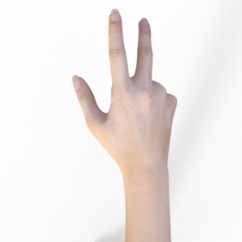
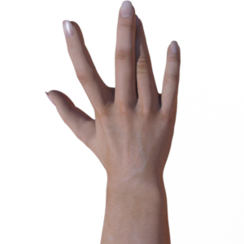

# ResNet-18 石头剪刀布手势识别

石头剪刀布是个简单的游戏，但让机器通过一张图片判断出手的手势并不容易——手的姿态、角度、光照、背景都会影响识别结果。本项目用 ResNet-18 做迁移学习，在石头/剪刀/布的手势图片数据集上微调模型，实现对三种手势的自动分类识别。

## 痛点与目的

- **问题**：手势识别在人机交互、体感游戏、手语翻译等场景中有广泛需求，但从零训练一个 CNN 需要大量数据和算力
- **方案**：利用 ImageNet 预训练的 ResNet-18 做迁移学习，只微调最后的全连接层，用少量手势数据就能达到较高准确率
- **效果**：在石头（rock）、剪刀（scissors）、布（paper）三类手势上实现准确分类

## 识别类别

| 类别 | 手势 |
|------|------|
| rock | 石头 ✊ |
| scissors | 剪刀 ✌️ |
| paper | 布 🖐️ |

## 使用方法

### 环境依赖

```bash
pip install torch torchvision matplotlib scikit-learn pillow
```

### 1. 数据集划分

```bash
python 1.py
```

将 `original_data/` 中的原始数据按比例划分为训练集、验证集和测试集，输出到 `dataset/` 目录。

### 2. 训练模型

```bash
python 2.py
```

使用预训练 ResNet-18 进行微调训练，训练结束后自动保存模型权重到 `model.pth`，并绘制训练过程中的损失和准确率曲线。

### 3. 单张图片推理

```bash
python 3.py
```

对指定图片进行手势分类预测。

### 4. 批量推理

```bash
python 4.py
```

对目录下的所有图片批量进行手势分类。

## 项目结构

```
.
├── 1.py                  # 数据集划分（train/val/test）
├── 2.py                  # ResNet-18 迁移学习训练
├── 3.py                  # 单张图片推理
├── 4.py                  # 批量推理
├── model.pth             # 训练好的模型权重
├── original_data/        # 原始数据集
│   ├── paper/
│   ├── rock/
│   └── scissors/
└── dataset/              # 划分后的数据集
    ├── train/
    ├── validation/
    └── test/
```

## 数据集样本

| 石头 ✊ | 剪刀 ✌️ | 布 🖐️ |
|:---:|:---:|:---:|
|  |  |  |

## 适用场景

- 手势识别与人机交互
- 体感游戏开发
- 图像分类迁移学习入门
- PyTorch 深度学习实践

## 技术栈

- PyTorch（ResNet-18 迁移学习）
- torchvision（预训练模型 + 数据增强）
- scikit-learn（数据集划分）
- Matplotlib（训练可视化）
- Python 3.x

## License

MIT License
